# Generousource – Crowdfunding Platform (Frontend)
**Author:** Maria Alistratova
**Live Demo:** https://generousource.netlify.app/

#### About the project 
This project is a web platform that allows registered users to create fundraising initiatives for various causes and support other users’ initiatives through monetary donations. Users can make donations in any amount, provided that the total pledged amount does not exceed the fundraising target.

#### Screenshots

##### Homepage (Guest User)
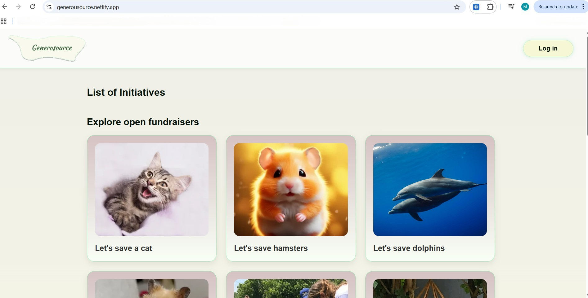

##### Homepage (User)
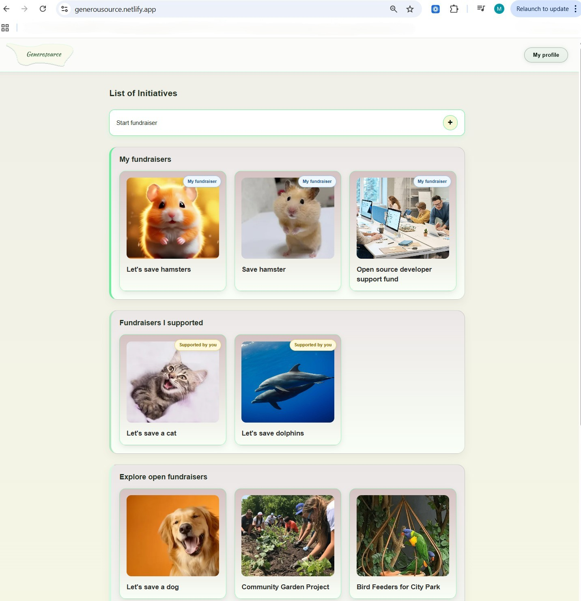

##### Homepage (Admin)
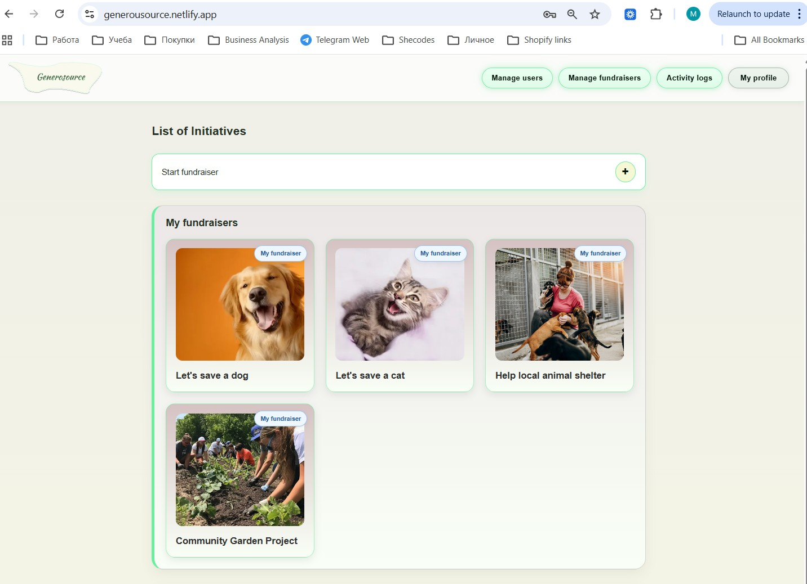

##### Fundraiser Details Page (Guest User)
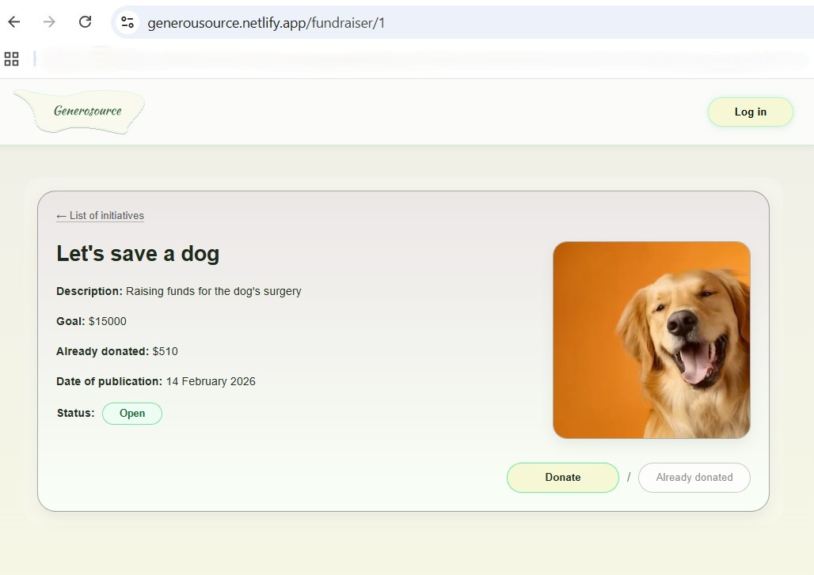

##### Fundraiser Details Page (Admin, Owner)
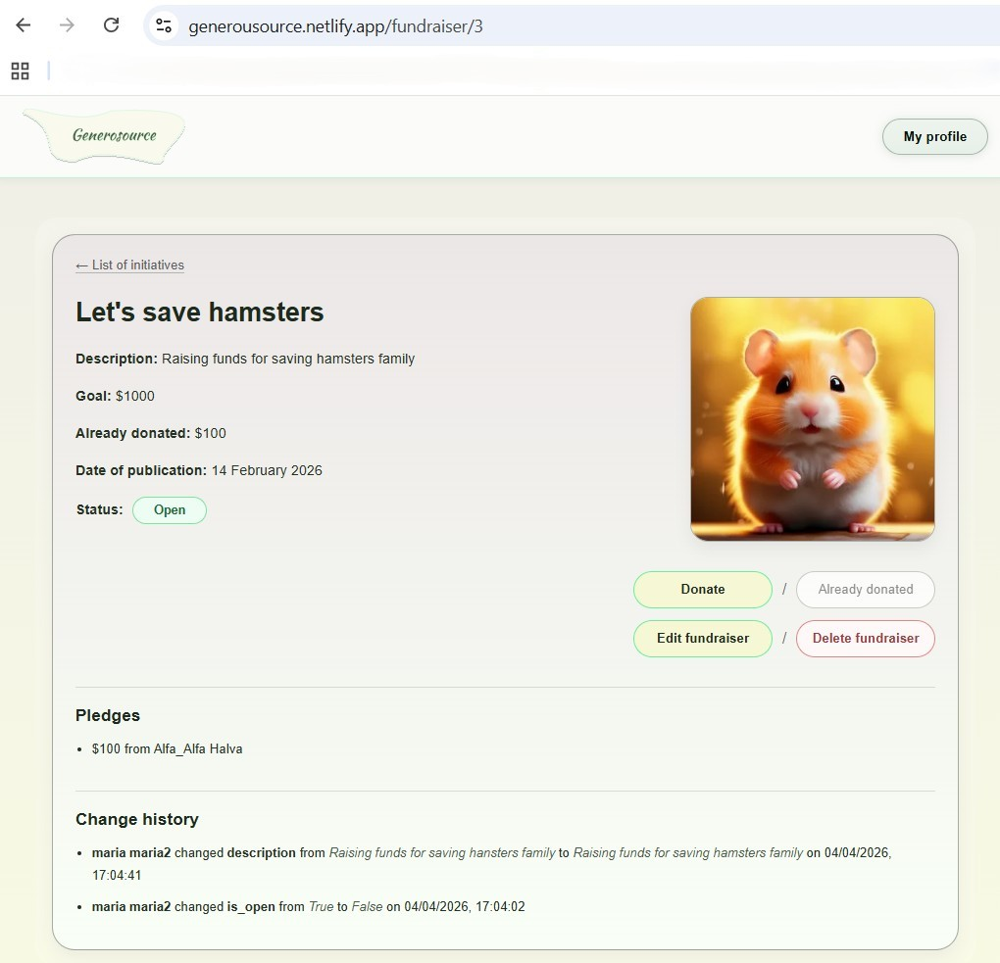

##### Fundraiser Create Page (Admin, Registered User)
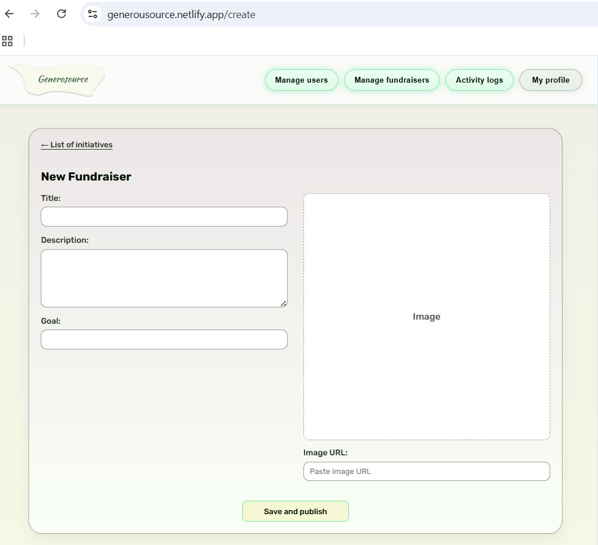

##### Fundraiser Edit Page (Admin, Owner)
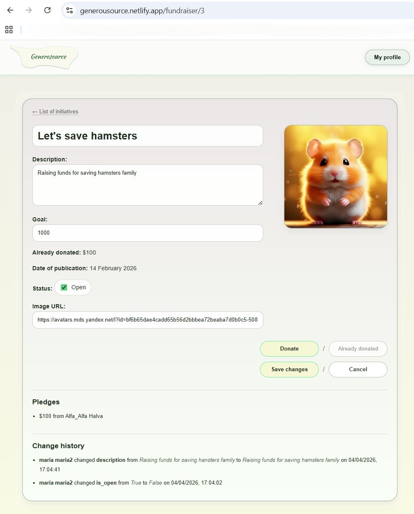

##### Donation Form
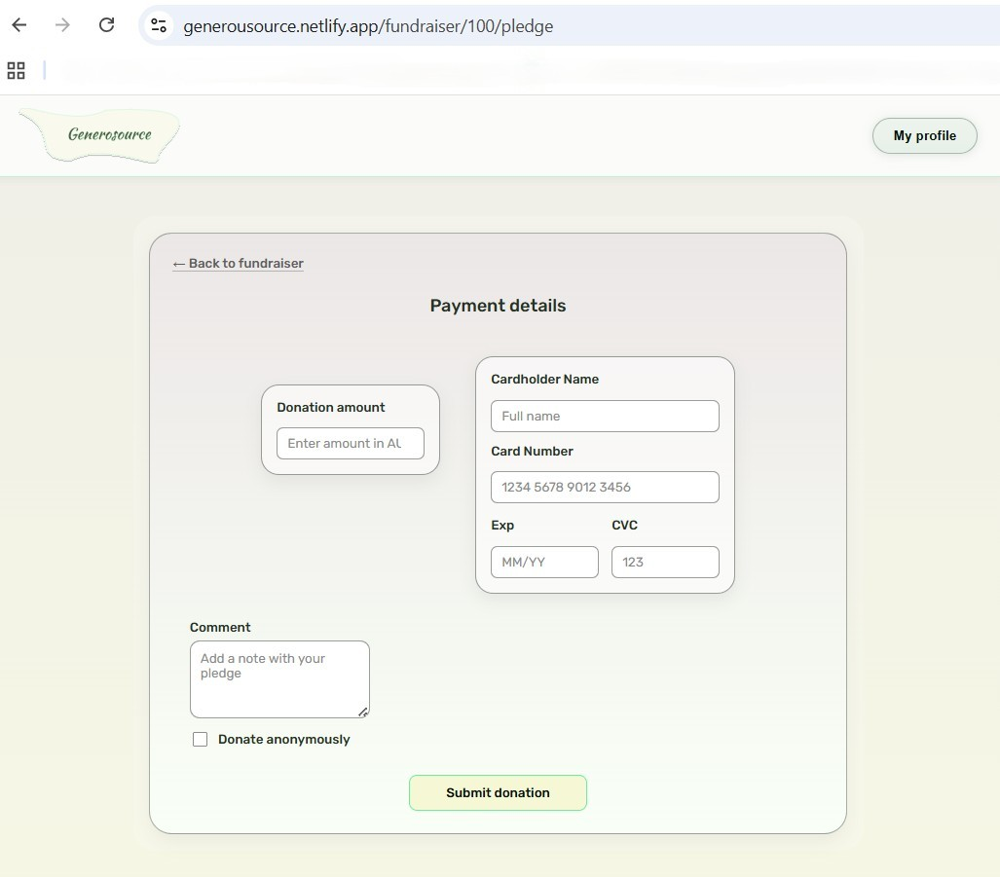

##### Admin – Manage Users
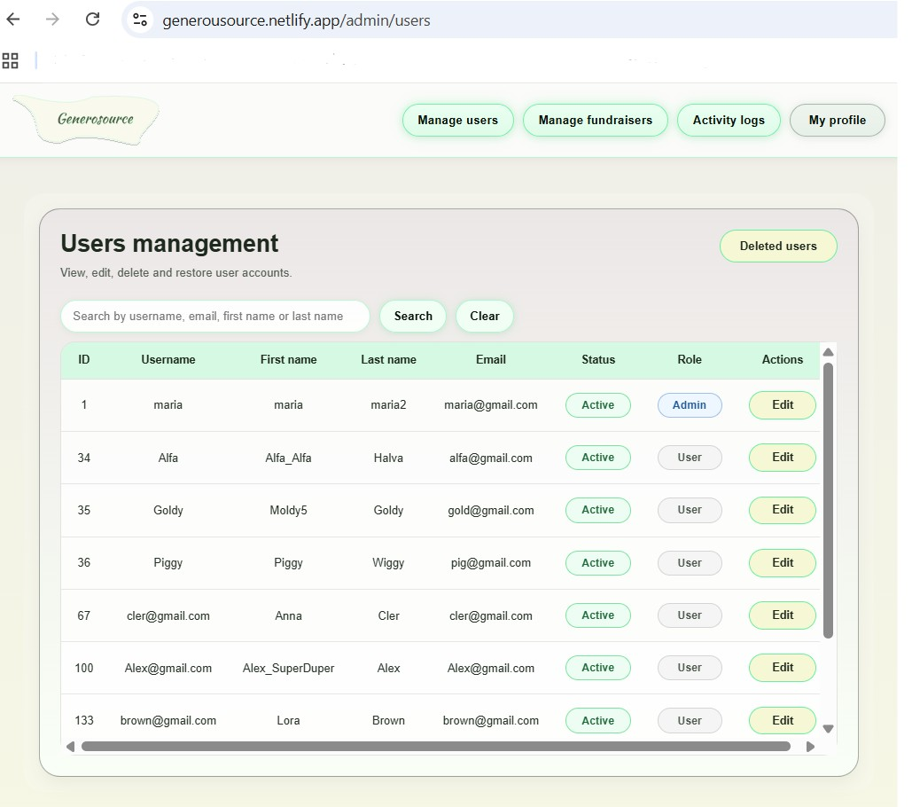

##### Admin – Deleted Users
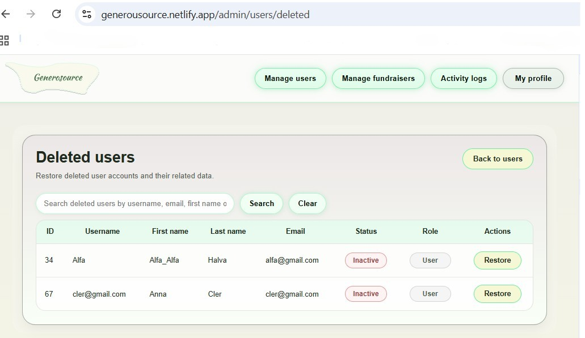

##### Admin – Manage Fundraisers
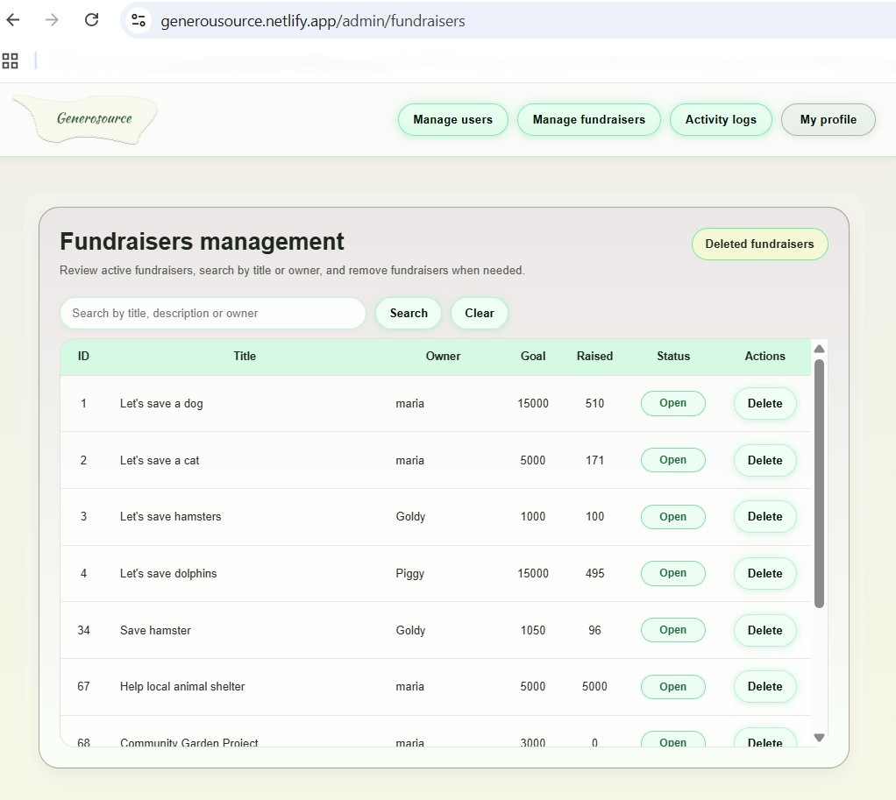

##### Admin – Deleted Fundraisers
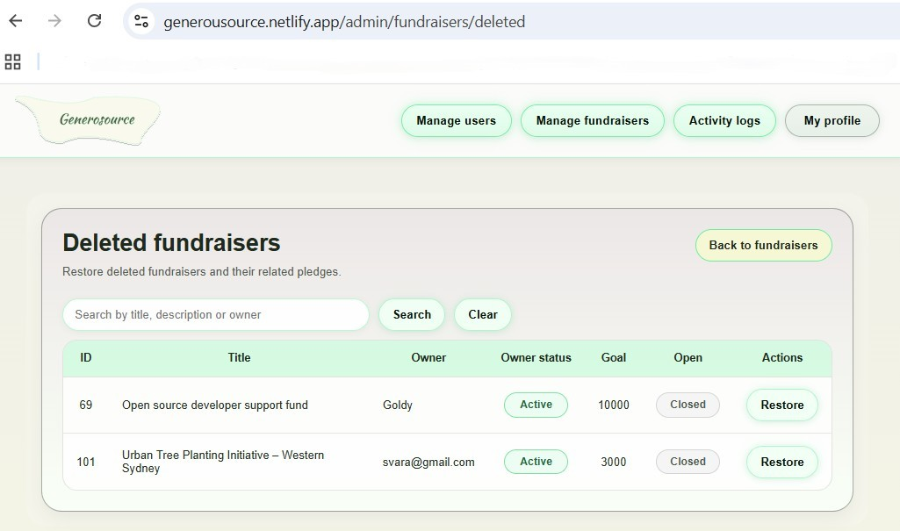

##### Admin – Activity Logs
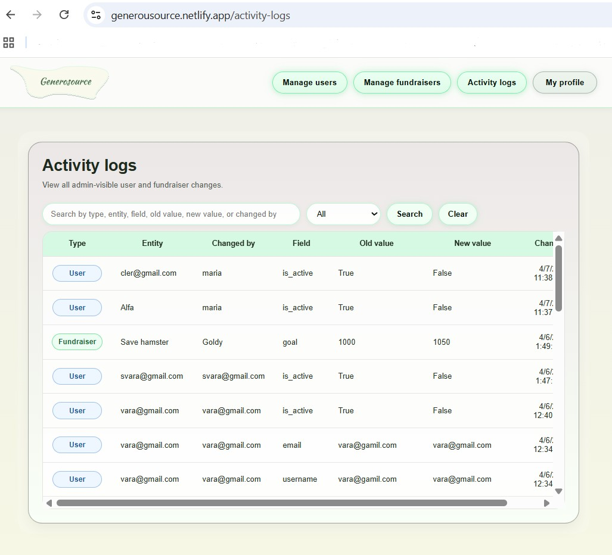


#### Intended Audience
The platform is intended for individuals who wish to raise funds for personal, social, or community causes, as well as for users who want to contribute financially to initiatives created by others.
It can also be integrated into a company’s internal processes, allowing employees to create fundraising initiatives for their needs.

#### Key features
##### User Features:
- User Authentication - Registration and Login system with token-based authentication
- Browse Fundraisers - View all active fundraisers on the homepage, organized by category:
    - My Fundraisers (created by the user)
    - Supported Fundraisers (ones the user has pledged to)
    - Open Fundraisers (available to support)
    - Completed Fundraisers (reached their funding goal)
- Create Fundraisers - Users can start new fundraising campaigns with goals and descriptions
- Make Pledges - Users can donate/pledge money to fundraisers
- View Fundraiser Details - Full details of each campaign including progress, pledges, and contributions
- Edit Fundraisers - Owners can modify their fundraiser details
- Delete Fundraisers - Soft delete functionality (can be restored by admins)
- Profile Management - Users can view and edit their profile (name, email, username, password)
- Delete Account - Users can delete their own account
##### Admin Features:
- Fundraiser Management - View, search, and manage all fundraisers; restore deleted ones
- User Management - View, search, and manage all users; restore deleted users
- Activity Logs - Track system activities
- Deleted Items Recovery - Restore deleted fundraisers and users
- Search Functionality - Search fundraisers and users
##### Technical Features:
- Modal notifications for user feedback (success, confirmation, error messages)
- Responsive navigation bar
- Role-based access control (admin vs regular users)

#### Tech Stack

- **Frontend Framework:** React 19.2.4
- **Routing:** React Router DOM 7.13.1
- **Build Tool:** Vite 8.0.0
- **Styling:** CSS3
- **Linting:** ESLint 9.39.4
- **Node Version:** v24.13.1

## Installation

### Prerequisites
- Node.js and npm installed on your system
- Backend API running

### Steps

1. **Clone the repository**
   ```bash
   git clone https://github.com/Haveatrytolearn/she-codes-crowdfunding-frontend.git
   cd crowdfunding-frontend
   ```

2. **Install dependencies**
   ```bash
   npm install
   ```

3. **Start the development server**
   ```bash
   npm run dev
   ```
   The application will be available at `http://localhost:5173`

## Environment Setup

### Create `.env.local` file

Create a `.env.local` file in the root directory of the project with the following configuration:

```env
VITE_API_URL=https://generousource-9fa74612af46.herokuapp.com
```

## API Integration

This frontend communicates with a backend API server for all data operations.

### API Endpoints

The application connects to the following API endpoints:

- **Authentication:** `/api-token-auth/` - Login and token generation
- **Users:** `/users/` - User registration, profile management
- **Fundraisers:** `/fundraisers/` - CRUD operations for fundraising campaigns
- **Pledges:** `/pledges/` - Create and manage pledges/donations
- **Activity Logs:** `/activity-logs/` - Retrieve platform activity records
- **Restore Operations:** `/fundraisers/restore/`, `/users/restore/` - Recover deleted items

### Frontend Routes

The application uses React Router for client-side navigation.

- `/` - Homepage
- `/login` - Login page
- `/signup` - Registration page
- `/profile` - User profile page
- `/create` - Create fundraiser page
- `/fundraiser/:id` - Fundraiser details page
- `/fundraiser/:id/pledge` - Donation page
- `/admin/users` - Admin users management
- `/admin/users/:id` - Admin user details/edit page
- `/admin/users/deleted` - Deleted users page
- `/admin/fundraisers` - Admin fundraisers management
- `/admin/fundraisers/deleted` - Deleted fundraisers page
- `/activity-logs` - Admin activity logs page

## Project Structure

```
src/
├── api/              # API call functions
│   ├── get-*.js      # GET requests
│   ├── post-*.js     # POST requests
│   ├── put-*.js      # PUT/UPDATE requests
│   └── delete-*.js   # DELETE requests
├── components/       # Reusable React components
│   ├── Modal.jsx     # Modal/popup component
│   ├── NavBar.jsx    # Navigation bar
│   ├── FundraiserCard.jsx   # Fundraiser display card
│   ├── PledgeForm.jsx       # Pledge submission form
│   └── ...
├── hooks/            # Custom React hooks
│   ├── use-fundraisers.js
│   ├── use-fundraiser.js
│   └── ...
├── pages/            # Page components
│   ├── HomePage.jsx
│   ├── LoginPage.jsx
│   ├── ProfilePage.jsx
│   ├── AdminUsersPage.jsx
│   ├── AdminFundraisersPage.jsx
│   ├── AdminActivityLogsPage.jsx
│   └── ...
├── assets/           # Static assets
├── main.jsx          # Application entry point
└── data.js           # Static/sample data
```

## Notes
- The UI adapts based on user role (guest, authenticated user, admin)
- Admin users have extended functionality for managing and restoring data
- All user interactions use custom modal components for consistent UX


